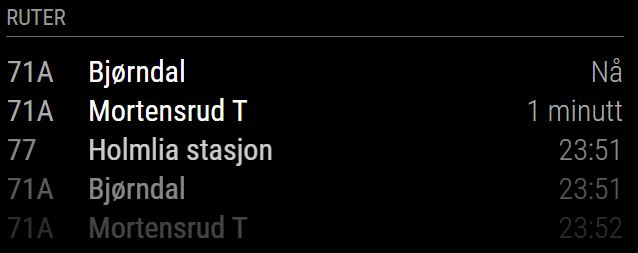
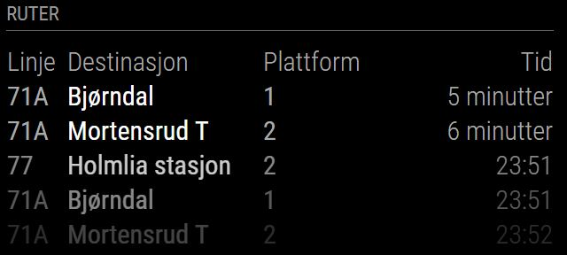

# MagicMirror² Module: Ruter
'MMM-Ruter' is a module for displaying public transport information for the Oslo and Akershus region in Norway on a [MagicMirror²](https://magicmirror.builders/). It's using data from [Ruter.no](http://reisapi.ruter.no/help).


 

Current version is 1.1.0 See [changelog](CHANGELOG.md "Version history") for version history.

## Installation

Remote to your MM2-box with your terminal software and go to your MagicMirror's Module folder:
````bash
cd ~/MagicMirror/modules
````

Clone the repository:
````bash
git clone https://github.com/CatoAntonsen/MMM-Ruter.git
````

Go to the modules folder:
````bash
cd MMM-Ruter
````

Install the dependencies:
````bash
npm install
````

Add the module to the modules array in the `config/config.js` file by adding the following section. You can change this configuration later when you see this works:
```
{
	module: 'MMM-Ruter',
	header: 'Ruter',
	position: 'top_left',
	config: {
		showPlatform: true, 
		maxItems: 10,
		stops: [
			{
				stopId: "3010972",
				platforms: [ "1", "2" ],
				timeToThere: 0
			}
		]
	}
},
```

# Configuration options

These are the valid configuration options you can put inside the config array above:

Configuration option | Comment | Default 
---|---|---
stops | Array of stops. See below | Empty array
maxItems | Number of journeys to display | 5 
showHeader | Set this to true to show header above the journeys | false
showPlatform | Set this to true to get the names of the platforms. Set this to true to check the name of the platform if you need to filter  | false
humanizeTimeTreshold | If time to next journey is below this value, it will be displayed as "x minutes" instead of time | 15 
serviceReloadInterval | Refresh rate in MS for how often we call Ruter's web service. NB! Don't set it too low! | 30000 
timeReloadInterval | Refresh rate how often we check if we need to update the time in the GUI | 1000 
animationSpeed | How fast the animation changes when updating mirror - in milliseconds | 0  
fade | Set this to true to fade list from light to dark | true  
fadePoint | Start fading on 1/4th of the list | 0.25

## Stops
You have to configure at least one stop. The module is using the same stop ID's as Ruter does in it's API. The simplest way to find those are to go to [https://ruter.no](https://ruter.no) in your browser and do a search _from_ your stop to somewhere/anywhere. Then extract `NNNNNN` from the resulting URL: https://ruter.no/reiseplanlegger/Mellom/Fra/(`NNNNNN`)*. 

Notice that you can only use stops, not addresses or areas. You can test if it is a valid stop by enter the following URL in your browser http://reisapi.ruter.no/StopVisit/GetDepartures/`NNNNNN` (replace `NNNNNN` with your id).

Stop option | Comment  
---|---|---
stopId | Id of stop  
platformFilter | The names of the platforms you want to see
timeToThere | How long time in minutes does it take for you to get to this stop? It's no point showing journeys that till go in 1 minute if it takes you 5 minutes to get there...

Example:
```
stops: [
	{
		stopId: "3010972",
		platforms: [ "1", "2" ],
		timeToThere: 0
	},
	{
		stopId: "3010910",
		timeToThere: 15
	},
]

``` 
## Translations

This modules is translated to the following languages:

Language | Responsible
---|---
nb (Norwegian) | Me
en (English) | Me

If you add other languages, please make a PR or drop me a line!

# Future enhanchements

1. Make it possible to have multiple instances of this module simultaneously
2. Show exceptions
3. Add filter for individual lines on one platform
